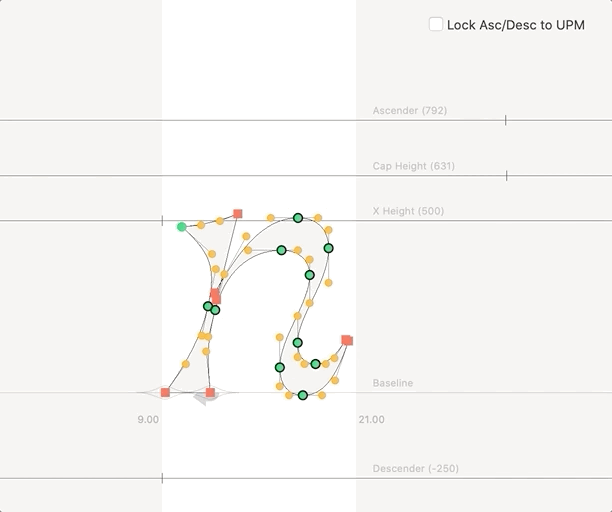

# Edit Font Dimensions

A RoboFont extension for quickly manipulating your font info’s “Dimensions” values.

## Instructions:
* Install extension once.
* Click toolbar icon.
* Decide whether you want to lock the ascender / descender relationship to the UPM or not. If you change the descender and then toggle the check box on, the ascender will snap to the UPM—and vice versa. (this feature idea thanks to Dyana Weissman)
* Move font dimension values. (temporarily selectable as guidelines)
* Exit tool and continue on with your life.

<br />




## To do:
* Support locking not just asc-desc, but max y and min y, perhaps.

### Versions

```
1.2.3 2023.05.31  Slightly better performance, code clean-up.
1.2.2 2020.04.03  Fix bug that left guidelines there if the font was closed while the extension was active. Issue #3
1.2.1 2020.04.03  User default on the toggle is stored now. Thanks for the tip, Connor. Issue #2
1.2.0 2020.04.03  Supporting locking asc-desc relationship to UPM. Thanks for the suggestion, Dyana Weissman!
1.1.1 2020.02.05  Fix need to unlock guides when using tool (if guides were locked). Thanks for the note, CJ Dunn!
1.0.0 2020.01.24  Initial release
```