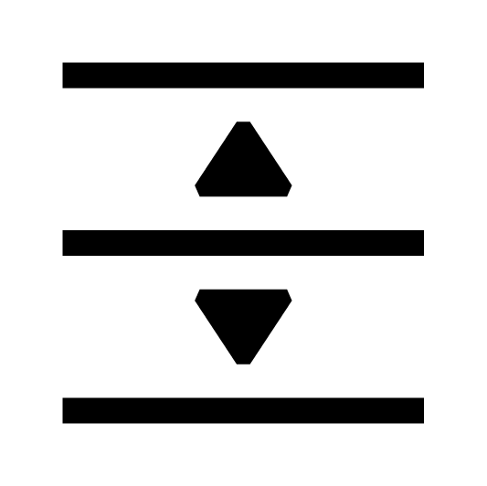
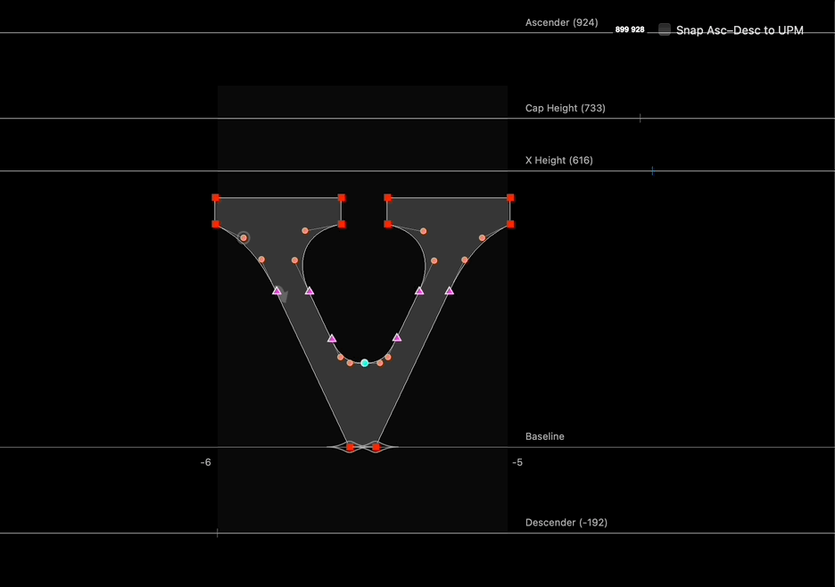

# Edit Font Dimensions



Edit Font Dimensions is a RoboFont extension that allows you to change your Font Dimensions directly in Glyph Editor.

## How to use:
1. Install extension.
2. Click toolbar icon.
3. Decide whether you keep the ascender-to-descender distance the same as UPM. 
> Note: If you change the descender and _then_ toggle the check box on, the ascender will snap to the UPM—and vice versa. (Thanks to Dyana Weissman for the feature idea!)

4. Move font dimension values. (draggable as guidelines)
5. Exit tool.

<br />





### Versions

```
2.0   2023.10.06  Bugfix for when multiple dimensions the share same value. Rewrite + performance. Works on multiple open fonts.
1.2.3 2023.05.31  Slightly better performance, code clean-up.
1.2.2 2020.04.03  Fix bug that left guidelines there if the font was closed while the extension was active. Issue #3
1.2.1 2020.04.03  User default on the toggle is stored now. Thanks for the tip, Connor. Issue #2
1.2.0 2020.04.03  Supporting locking asc-desc relationship to UPM. Thanks for the suggestion, Dyana Weissman!
1.1.1 2020.02.05  Fix need to unlock guides when using tool (if guides were locked). Thanks for the note, CJ Dunn!
1.0.0 2020.01.24  Initial release
```